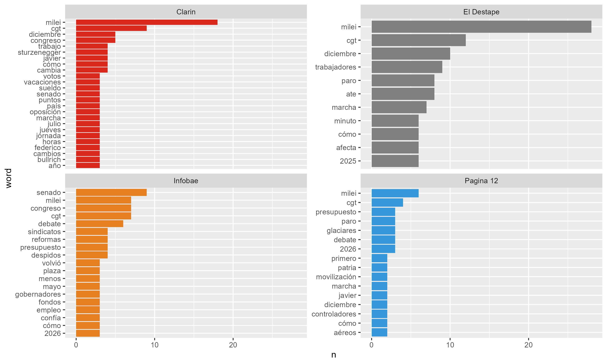
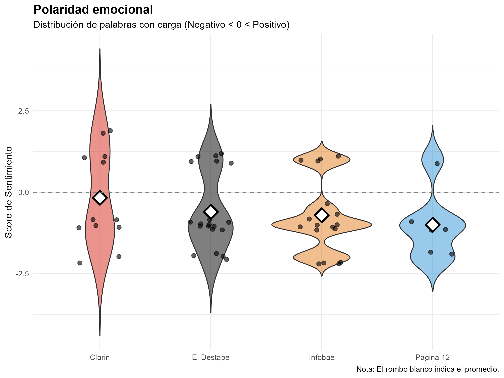

# Media framing and polarization in Argentina: A computational analysis of the labor reform


## Summary
This project employs methods from computational social science and Natural Language Processing (NLP) to quantify ideological divergence within the Argentine media ecosystem. Specifically, it examines the coverage of the 2025-2026 labor reform debate.

Using a hybrid workflow, using python for web scraping and data mining and R for statistical analysis, the study analyzes a corpus of 400 headlines from four major news outlets representing the political spectrum: Infobae and Clarin, center-right or pro-market, versus Pagina 12 and El Destape, center left or opposition. The findings reveal significant asymmetry in both agenda-setting strategies and emotional polarity.

**Research question:** How do opposing media outlets construct the semantic and emotional narrative of the labor reform in a context of high political polarization?

* **Hypothesis 1:** Pro-government media will frame the reform through institutional and procedural terminology, whereas opposition media will frame it through the lens of social conflict and economic distress.
* **Hypothesis 2:** Standard sentiment analysis libraries fail to capture local sociopolitical nuances. A domain-specific analysis will reveal that opposition media exhibit a marked negative skew, while pro-market media maintain a strategy of neutrality or cautious optimism.

## Methodology
The research follows a reproducible pipeline designed to overcome dynamic web rendering issues and linguistic contextual barriers.
The data quisition was conducted with python. Google News RSS Feeds were filtered by domain. A cross-sectional dataset of aproximately 100 headlines per outlet (N=400) was collected to ensure statistical stability. A post-hoc semantic relevance filter was applied to remove unrelated content and retain only headlines containing domain-specific keywords.
Then preprocessing was conducted using R. Tokenization, stop-word removal, and text cleaning were performed using the 'tidytext' package. Frequency comparison and Log-Odds Ratio analysis were used to identify distinctive vocabulary for each outlet. 
Because standard spanish lexicons often misclassify argentine political jargon, an ad-hoc wighted lexicon was developed to assign polarity scores based on local usage. For example, terms such as "ajuste", "motosierra", or "casta" were weighted according to their specific connotation in the local discourse. 

## Results

The lexical frequency analysis confirms a distinct division in narrative focus among the outlets. El Destape and Pagina 12 prioritize actors of resistance and conflict (e.g., "Workers", "Union", "Strike", "March"). On the other hand, Infobae prioritizes the legislative and bureaucratic process (e.g., "Senate", "Debate", "Bill"), effectively sanitizing the conflict. And Clarin focuses heavily on specific political figures within the administration (e.g., "Bullrich", "Sturzenegger", "Milei"), highlighting internal power dynamics.



The density analysis reveals the emotional temperature of the coverage. El Destape displays the most negative distribution, concentrating its editorial mass on crisis terminology. Infobae displays a mean sentiment close to zero (neutral), reflecting an editorial choice to appear objective. Pagina 12 and Clarin show intermediate negative skews, though qualitative differences exist in their vocabulary choice.



## Ethical considerations
This project strictly adheres to principles of ethical web scraping and EU directives regarding text mining. The scraper implements intentional latency to prevent server overload, respecting the target infrastructure. The dataset contains only headlines and metadata. The full body of the articles is not redistributed in this repository. This analysis falls under the academic exception for Text and Data Mining (TDM) (EU Directive 2019/790), which permits the mining of lawfully accessible works for scientific research purposes.

## Limitations
The data represents a cross-section of a specific timeframe. Media sentiment is volatile and may shift during specific events. Moreover, the Bag-of-Words (BoW) model utilized does not detect sarcasm. Also, the analysis is limited to headlines. The body of the articles may present a more nuanced perspective than the titles suggest.

## Usage
To reproduce this analysis locally:

1.  **Clone the repository:**
    ```bash
    git clone [https://github.com/juanaluz/argentina-labor-reform-nlp.git](https://github.com/juanaluz/argentina-labor-reform-nlp.git)
    ```
2.  **Run the scraper (Python):**
    ```bash
    pip install -r requirements.txt
    python scraper_reforma.py
    ```
3.  **Run the analysis (R):**
    Open `analisis_reforma.R` in RStudio and execute the script.

---
By **Juana Luz Carbajal** 

[](https://www.linkedin.com/in/juanaluz/)
